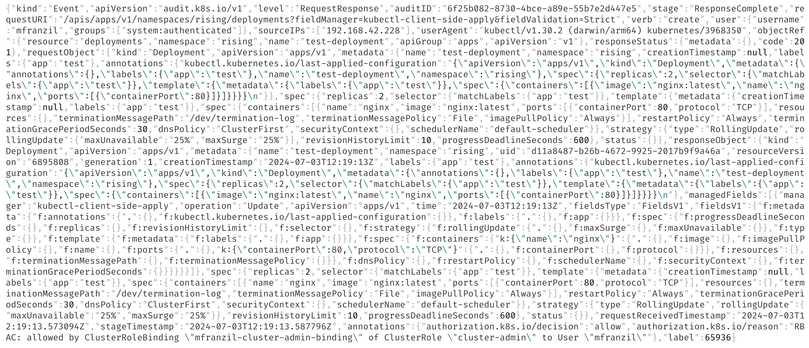

# Sharpening Kubernetes Audit Logs with Context Awareness

This repository holds the code for K8NTEXT, a project that aims to enhance Kubernetes audit logs by correlating them. The goal is to provide a more comprehensive understanding of the events occurring in a Kubernetes cluster by linking related audit log entries together.

The following files are available:

- `README.md`: this file;
- `parseLog`: the source code for K8NTEXT, which includes the logic for parsing and correlating audit logs;
- `analysis`: contains a script for comparing the results of the clustering process, including an HTML visualizer;
- `data-collection`: scripts used to collect the dataset from a Kubernetes cluster;
- `plots`: scripts for generating plots and visualizations from the results;
- `tests`: some shell scripts for evaluating K8NTEXT. The data is then fed to the `plots` scripts.
- `scripts`: miscellaneous scripts used for various tasks. Not fundamental to the project.

## Premise



Kubernetes audit logs provide a detailed record of the activities occurring within a Kubernetes cluster. However, these logs can be overwhelming due to their verbosity and lack of context. K8NTEXT addresses this challenge by correlating related audit log entries, thereby enhancing the interpretability of the logs.

From a high-level perspective, K8NTEXT works as follows:

1. Audit logs are collected from a Kubernetes cluster with
   auditing enabled. Logs are exposed in JSON format with a specific structure
   which is defined by the Kubernetes API.
2. Data is automatically preprocessed to reorder
   and clean the logs. Then, a ML model automatically divides the logs in batches
   and applies labels to them. A majority voting system is used to assign a label
   to each log entry from the multiple predictions made on each batch.
3. Once the logs have been labeled, each label group is further
   divided into clusters using a custom clustering algorithm, which groups together
   related log entries based on a series of heuristics such as time proximity, resource
   similarity, user identity, and more.
4. After processing, the logs with their labels and UUIDs can be used in
   downstream tasks, such as visualization and analysis. The `analysis` directory
   contains a script that generates an HTML file with a timeline view of the
   clustered events, allowing for easy exploration and analysis of the
   relationships between different log entries.

After processing, the logs are enriched with additional fields that indicate their labels and cluster assignments. This enriched data can then be used for further analysis and visualization.

## Getting started

To get started with K8NTEXT, follow these steps:

1. Clone the repository:

   ```bash
   git clone https://github.com/daisyfbk/k8ntext.git
   ```

2. Navigate to the project directory:

   ```bash
    cd k8ntext
    ```

3. Install the required dependencies:

    ```bash
    pip install -r requirements.txt
    # If on macOS, use requirements-macos.txt instead
    ```

## Use cases

### Training a model

The dataset is in the Releases section of this repository, due to its size. Download it and extract it to a folder of your choice (e.g., `audit-log`). The dataset can be also be created using the `data-collection` scripts (see below).

In order to train a model:

1. `cd` into `parseLog`:

   ```bash
   cd parseLog
   ```

2. Use `model.py` to train a model:

   ```bash
   python3 model.py -f $DATASET_FILE
   ```

   where `$DATASET_FILE` is a JSON file containing a labeled dataset. By default, `model.py` runs `STATISTICS_ATTEMPTS` training attempts with different train/test splits, saves each trained model in `out/attempt_*`, and writes aggregate statistics in `out`.

   If you want a single training run instead, disable statistics:

   ```bash
   python3 model.py -f $DATASET_FILE --no-statistics
   ```

   Use `--kfolds` to switch to k-fold cross-validation, or `--no-save` to skip saving trained models during training and labeled datasets during inference.

The model can be deeply customized by editing the `parameters.py` file. The features used for training are in `model_features.py`. For example, in `parameters.py`, the key of the label can be changed by modifying the `LABEL_KEY` variable, which is set to `label` by default.

For convenience, our dataset is available in the `audit-log` directory. The train-test-validation split is automatically done by `model.py`.

### Running a pre-trained model

Once a model has been trained, it can be used to make predictions on new data.

1. `cd` into `parseLog`:

   ```bash
   cd parseLog
   ```

2. Use `model.py` to make predictions:

   ```bash
   python3 model.py -m $MODEL_FILE -f $DATASET_FILE
    ```

   where `$MODEL_FILE` is the path to the trained model (for example, `out/model.keras` after `--no-statistics`, or `out/attempt_0/model_0.keras` with the default training flow) and `$DATASET_FILE` is a JSON file containing the dataset to be used for inference. The predictions will be saved in the `out` directory, and inference also writes `labeled.json` by default unless `--no-save` is set. The same dataset format used for training is used for inference.

### Clustering the model results

Once predictions have been made, the results can be clustered using the `cluster.py` script.

1. `cd` into `parseLog`:

   ```bash
   cd parseLog
   ```

2. Use `cluster.py` to cluster the results:

   ```bash
   python3 cluster.py -f $DATASET_FILE [-k $LABEL_KEY]
   ```

   where `$DATASET_FILE` is the JSON file containing the dataset with predictions, `-k $LABEL_KEY` is an optional argument to specify the key used for labels (default is `label`, but if you are running it on a labeled dataset, you might want to set it to `predicted_label`).
   The results are output to the `out` directory.

### Visualizing the results

The results of the clustering process can be visualized using the `visualize_timeline.py` script under `analysis`. This script generates an HTML file that provides a timeline view of the clustered events, allowing for easy exploration and analysis of the relationships between different log entries.

To visualize the results:

1. `cd` into `analysis`:

   ```bash
   cd analysis
   ```

2. Use `visualize_timeline.py` to generate the visualization:

   ```bash
   python3 visualize_timeline.py -f $LOG_FILE -o $OUTPUT_FILE --scale $SCALE --palette $PALETTE
   ```

   where `-f` specifies the input JSON file containing the clustered results, `-o` specifies the output HTML file, `--scale` adjusts the time scale of the timeline, and `--palette` allows you to choose a color palette for the visualization (you can choose from `cluster`, `verb`, `user`, or `resource`).

### Additional documentation

In the [docs/additional-features.md](docs/additional-features.md) file, you can find documentation on additional features and scripts. This includes scripts for labeling logs, testing the labeling process, and generating plots from the results.

## License

This software is licensed under the Creative Commons Attribution-NonCommercial-NoDerivatives 4.0 International license. More information is available in the `LICENSE` file.

## Acknowledgements

When citing this project, please use the following citation:

```generic
[1] M. Franzil, V. Armani, L. A. Dias Knob, and D. Siracusa, ‘Sharpening Kubernetes Audit Logs with Context Awareness’, Computer Networks, p. 111890, Nov. 2025, doi: 10.1016/j.comnet.2025.111890. Available: https://www.sciencedirect.com/science/article/pii/S1389128625008564.
```

The authors of this project are:

- [Matteo Franzil](https://github.com/mfranzil), University of Trento and Fondazione Bruno Kessler - `matteo.franzil@unitn.it`
- Valentino Armani, Fondazione Bruno Kessler - `varmani@fbk.eu`
- [Luis Augusto Dias Knob](https://github.com/luisdknob), Fondazione Bruno Kessler - `l.diasknob@fbk.eu`
- [Domenico Siracusa](https://github.com/custoz), University of Trento and Fondazione Bruno Kessler - `domenico.siracusa@unitn.it`
